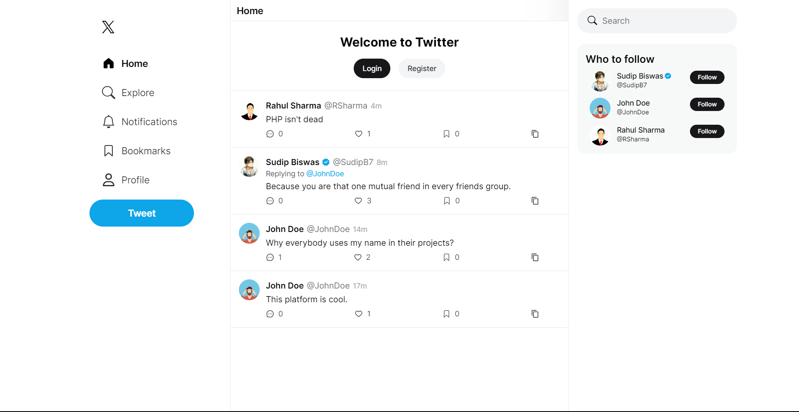
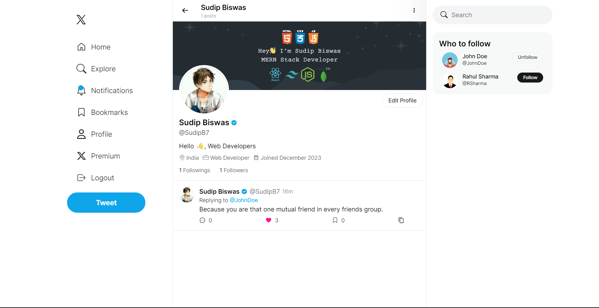

# X Clone

Replica of you favorite social media platform of X (Previously known as Twitter). Post tweets, Customize your profile, follow people, notifications and many more.

### Deployed [Link🔗](https://x-clone-sb.vercel.app)

## Images

### Hero



### Profile



## Tech Stack

- NextJS
- ReactJS
- TypeScript
- Prisma
- Next-Auth
- MongoDB
- Tailwind CSS

## Implementations

- Authentication
- Protected routes
- Custom hooks
- Vercel analytics & speed insights
- Image upload
- CRUD operations
- API creation
- Data fetching
- Loading states
- Customizable modals
- Reusable and customizable components

## Setting up locally

### 1. Clone on your local machine

```bash
https://github.com/sudipb7/x-clone.git
```

### 2. Install dependencies

```bash
npm install
```

### 3. Add environment variables to your `.env` file

```ts
DATABASE_URL="mongodb+srv://<username>:<password>@cluster0.mscaygz.mongodb.net/X-Clone"
NEXTAUTH_SECRET="<YOUR_NEXTAUTH_SECRET>"
NEXTAUTH_JWT_SECRET="<YOUR_NEXTAUTH_JWT_SECRET>"
NEXT_PUBLIC_BASE_URL="http://localhost:3000"
```

### 4. Run on your local server

```bash
npm run dev
```

## Connect with me

[Twitter](https://twitter.com/SudipB7_)

[LinkedIn](https://linkedin.com/in/sudipb7)

[Instagram](https://instagram.com/sudipb7_)
